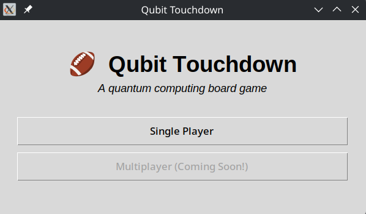
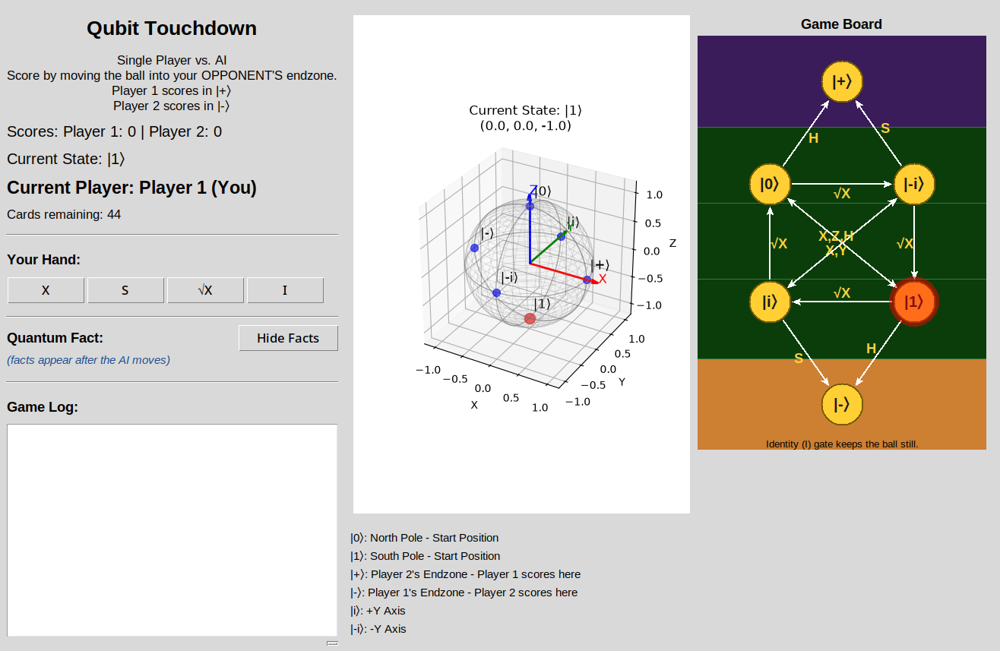

# Qubit Touchdown

A quantum computing board game where you manipulate a qubit (the football) using quantum gates to score touchdowns in your opponent's endzone.  
Play against an AI opponent that uses real quantum simulations (PennyLane) to pick its moves.

---

## Table of Contents
- [Overview](#overview)
- [Features](#features)
- [Screenshots](#screenshots)
- [How to Play](#how-to-play)
- [Quantum Mechanics Behind the Game](#quantum-mechanics-behind-the-game)
- [Installation](#installation)
- [Acknowledgements & Disclaimer](#acknowledgements--disclaimer)

---

## Overview
Qubit Touchdown is an educational game that teaches quantum computing concepts.  The original idea of Qubit Touchdown was created by Thomas G. Wong, and is referenced in his textbook:

[Introduction to Classical and Quantum Computing](https://www.thomaswong.net/introduction-to-classical-and-quantum-computing-1e4p.pdf)
- pages 73-79

[Qubit Touchdown](https://www.thegamecrafter.com/games/qubit-touchdown)

In Qubit Touchdown, players take turns playing cards that apply quantum gates to the qubit which will move between six states on the Bloch sphere. By playing quantum gate cards, you try to reach your opponent's endzone while blocking theirs. The game includes:

- A **3D interactive Bloch sphere** (powered by Matplotlib).
- A **2D game board** showing the state diagram and gate arrows.
- An **AI opponent** for single-player mode.
- **Quantum fact pop‑ups** after each AI move.

---

## Features
- **Real quantum simulation** – All gate operations are simulated with PennyLane, so the physics is authentic.
- **Visual feedback** – See the qubit state in 3D (Bloch sphere) and on a 2D board.
- **AI opponent** – The AI analyses each possible card and chooses the one that gets closest to the endzone (or scores immediately).
- **Quantum facts** – Learn interesting facts about quantum computing as you play.

---

## Screenshots
- Start screen

  

- Main game window (3D sphere + 2D board + hand)

  
---

### How to Play

1. **Objective** – Move the qubit (football) into your opponent's endzone.
   - Player 1 scores when the ball is in **|+⟩** (purple endzone).
   - AI/Player 2 scores when the ball is in **|-⟩** (green endzone).
2. **Your turn** – Click a card from your hand to play it.
   - Each card applies a quantum gate (I, X, Y, Z, H, S, √X, or Measurement).
   - The ball moves according to the gate's effect on the current state.
3. **AI turn** – The AI automatically chooses and plays a card after a short delay.
4. **Measurement** – If you play the Measurement card while the ball is in a superposition (not |0⟩ or |1⟩ states), it collapses to either |0⟩ or |1⟩.
5. **Scoring** – When you reach your opponent's endzone, you score a touchdown. The ball resets to a random pole state, and ball possession changes.
6. **Game Over** – When both players run out of cards, the player with the most points wins.

---

## Quantum Mechanics Behind the Game

- **Qubit states** – The six positions correspond to the eigenstates of the Pauli operators:
  - \( |0⟩, |1⟩ \) – Z‑basis
  - \( |+⟩, |-⟩ \) – X‑basis
  - \( |i⟩, |-i⟩ \) – Y‑basis
- **Gates** – Each card applies a unitary operation:
  - **I** – Identity (does nothing).
  - **X, Y, Z** – Pauli rotations (180° around the respective axis).
  - **H** – Hadamard (creates superposition).
  - **S** – Phase gate (90° rotation around Z).
  - **√X** – Square root of X (90° rotation around X).
  - **Measurement** – Collapses superposition to |0⟩ or |1⟩.
- **Simulation** – All moves are computed via PennyLane's `default.qubit` simulator, ensuring exact quantum mechanics.

---

## Installation

#### Prerequisites
- Python 3.8 or later

#### Clone the repository:
```bash
git clone https://github.com/raumsie/qubit-touchdown.git

cd qubit-touchdown
```

#### (Optional) Create and activate a virtual environment:
```bash
python -m venv venv
source venv/bin/activate   # On Windows: venv\Scripts\activate
```

#### Install dependencies:
```bash
pip install -r requirements.txt
```

#### Run the game:
```bash
python QubitTouchdown.py
```

--------------------------------------------------------------------
## Acknowledgements & Disclaimer
This repository (Qubit Touchdown) is an open‑source digital adaptation of the physical board game of the same name, originally created by **Thomas G. Wong** and described in his textbook _Introduction to Classical and Quantum Computing_.

- **All rights to the original board game concept, rules, game board design, and any associated trademarks or intellectual property belong solely to Thomas G. Wong.**
    
- **This repository is not affiliated with, endorsed by, or sponsored by the original creator or any publisher.**
    
- **The code in this repository is released under the GNU General Public License (GPL). This license applies only to the source code, not to the underlying game IP.**
    
- **If you are the original creator and you have any concerns about this adaptation, please open an issue or contact me directly. I would be happy to comply with your wishes, including removing the repository if requested.**
